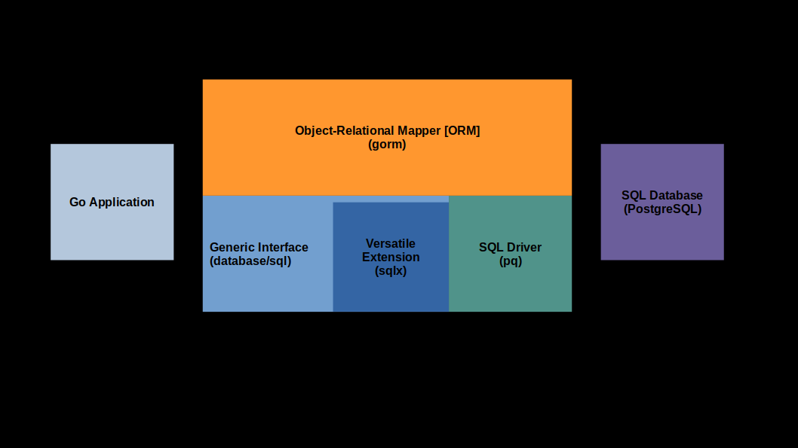

#### Instructions

Working with databases in golang the following:
- **database/sql** package is part of Go standard library. It provides **generic interface** to interact with SQL databases. It allows the use of any sql database that **implements the database/sql interface**. It serves as a fundamental **abstraction layer**.

- **SQL drivers** are third-party packages that implement the **database/sql** interface for specifig SQL database systems like MySQL, PostgreSQL, SQLite etc..

> The generic interface (database/sql package) defines a common API for database interactions, making the application code independent of any specific database system.

> SQL drivers are separate packages responsible for implementing the details and functionalities required to communicate with a particular SQL database, bridging the gap between the generic interface and the database system. 

> Together, they enable **database agnoticism, portability and efficient communication** with various SQL databases in Go applications.

- **gorm** is an Object-Relation Mapping (ORM) library for Go (third-party library), which provides higher-level abstraction over SQL databases. It simplifies database interactions by allowing to work with Go structs instead of writing raw SQL queries.

> GORM is an ORM library that simplifies database interactions in Go applications. It works in conjunction with the generic interface(**database/sql** package) and SQL drivers to provide a more intuitive and object-oriented approach to database management.

- **sqlx** is a package (versatile extension) that extends the capabilities of the **database/sql** package (third-party package). It provides a set of **utility functions** to work with SQL databases more conveniently. How?

- **pq** package (sql driver) is specific to PostgreSQL and offers additional features and optimizations for working with PostgreSQL databases.

- **psql** is the command-line interface for PostrgreSQL, a powerful relationanl database management system.

These package enable to **connect**, **query** and **manage** SQL databases efficiently.



---

#### Installation
- Installing **gorm** orm:
    ```
    go get gorm.io/gorm
    ```
- Installing **sqlx** extension:
    ```
    go get github.com/jmoiron/sqlx
    ```
- Installing **pq** sql driver:
    ```
    go get github.com/lib/pq
    ```
- Installing **postgres** db:
    - On Ubuntu:
    ```
    sudo apt-get update
    sudo apt-get install postgresql
    ```
    - On MacOS:
    ```
    Some commands..
    ```
    - In Docker:
    ```
    Some commands..
    ```
---

#### Instructions
- Pull pre-built postgres docker image from Docker Hub:
    ```
    docker pull postgres
    ```
- Run container with postgres docker image:
    ```
    docker run\
    --name postgres-container\
    -e POSTGRES_PASSWORD=<password>\
    -e POSTGRES_DB=<db_name>\
    -d\
    -p 5432:5432\
    postgres
    ```
- Run container with psql client:
    ```
    docker run\
    --name psql-container\
    --link postgres-container:postgres\
    -it postgres\
    psql -h postgres\
    -U postgres
    ```
